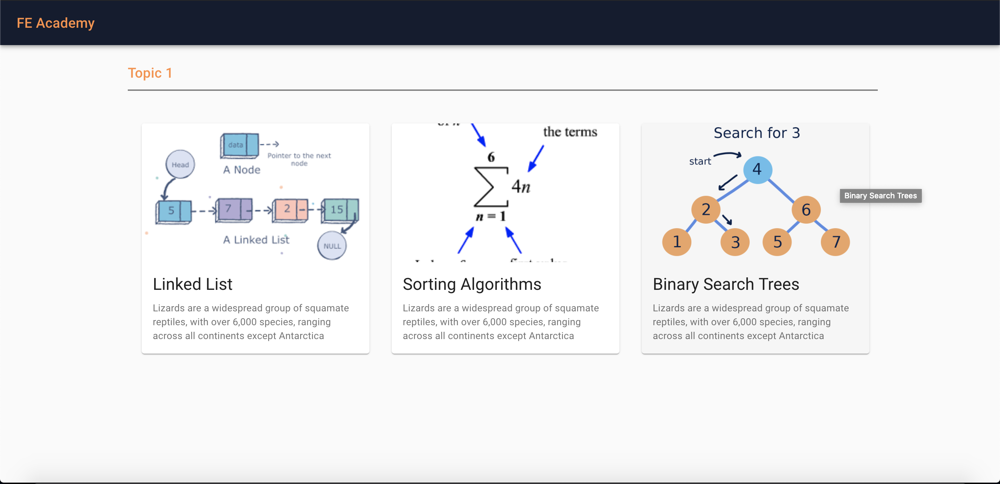

<!--
*** Thanks for checking out this README Template. If you have a suggestion that would
*** make this better, please fork the repo and create a pull request or simply open
*** an issue with the tag "enhancement".
*** Thanks again! Now go create something AMAZING! :D
-->


<!-- PROJECT LOGO -->
<br />
<p align="center">
  <a href="https://knighthacks.org/">
    
  </a>

  <h1 align="center">FE Academy Backend</h1>

  <p align="center">
    A website application to help UCF CS students with the Foundation Exam
    <br />
  </p>
</p>


<!-- TABLE OF CONTENTS -->
## Table of Contents

* [About the Project](#about-the-project)
  * [Built With](#built-with)
* [Getting Started](#getting-started)
  * [Prerequisites](#prerequisites)
  * [Installation](#installation)
* [License](#license)
* [Contact](#contact)
* [Acknowledgements](#acknowledgements)


<!-- ABOUT THE PROJECT -->
## About The Project
<p align="center">
  <a href="https://github.com/JustinHawtree/FE_Academy_KnightHacks2020">
    
  </a>
</p>
At the University of Central Florida, emerging Computer Science students are required to take a Foundation Exam (FE) in order to get accepted into the college. Although there are many great resources available online to learn about Data Structures and Algorithms, Our team didn't find one that really suit my needs when I was a student studying for the FE exam so we created FE Academy. The solutions posted from previous exams were just one way of solving the problem and we wanted to create a way to detect if other variations of solutions would also solve the same problem. So we created an immersive, interactive experience so amazing that it'll be the last resource you'll ever need to prepare for the Foundation Exam.

Here's why:
* Your time should be focused on mastering Computer Science fundamentals, not searching high and low trying to find the right resources.
* All topics in one place. No need to keep track of whether you missed studying any of the topics, FE Academy has all the fundamental topics in one place!
* See feedback immediately! FE Academy has a built-in text editor and compiler that will run your code through our handwritten testcases for each problem.

<p align="center">
  <a href="https://github.com/JustinHawtree/FE_Academy_KnightHacks2020">
    
  </a>
</p>

### Built With
* [GoFiber/Fiber](https://github.com/gofiber/fiber)


<!-- GETTING STARTED -->
## Getting Started

### Prerequisites

This is an example of how to list things you need to use the software and how to install them.
* npm
```sh
npm install npm@latest -g
```

### Installation


1. Clone the repo
```sh
git clone https://github.com/JustinHawtree/FE_Academy_KnightHacks2020.git
```
1. Install Go packages
```sh
go install
```
3. Start Server
```sh
go run main.go
```

<!-- LICENSE -->
## License

Distributed under the MIT License.


<!-- CONTACT -->
## Contact

[Justin Hawtree](https://github.com/JustinHawtree) - BackEnd Lead - [Linked-in](https://www.linkedin.com/in/justin-hawtree/) - JustinHawtree@knights.ucf.edu

[Daniel Lam](https://github.com/dlam96) - FrontEnd Lead - [Linked-in](https://www.linkedin.com/in/dlam96/) - dlam96@knights.ucf.edu

[Leo Zhang](https://github.com/leozhang1) - FrontEnd Dev

Project Link: [DevPost](https://devpost.com/software/fe-academy?ref_content=user-portfolio&ref_feature=in_progress)


<!-- ACKNOWLEDGEMENTS -->
## Acknowledgements
* [Knight Hacks](https://knighthacks.org/)


<!-- MARKDOWN LINKS & IMAGES -->
<!-- https://www.markdownguide.org/basic-syntax/#reference-style-links -->
[contributors-shield]: https://img.shields.io/github/contributors/othneildrew/Best-README-Template.svg?style=flat-square
[contributors-url]: https://github.com/othneildrew/Best-README-Template/graphs/contributors
[forks-shield]: https://img.shields.io/github/forks/othneildrew/Best-README-Template.svg?style=flat-square
[forks-url]: https://github.com/othneildrew/Best-README-Template/network/members
[stars-shield]: https://img.shields.io/github/stars/othneildrew/Best-README-Template.svg?style=flat-square
[stars-url]: https://github.com/othneildrew/Best-README-Template/stargazers
[issues-shield]: https://img.shields.io/github/issues/othneildrew/Best-README-Template.svg?style=flat-square
[issues-url]: https://github.com/othneildrew/Best-README-Template/issues
[license-shield]: https://img.shields.io/github/license/othneildrew/Best-README-Template.svg?style=flat-square
[license-url]: https://github.com/othneildrew/Best-README-Template/blob/master/LICENSE.txt
[linkedin-shield]: https://img.shields.io/badge/-LinkedIn-black.svg?style=flat-square&logo=linkedin&colorB=555
[linkedin-url]: https://linkedin.com/in/othneildrew
[product-screenshot]: images/screenshot.png
